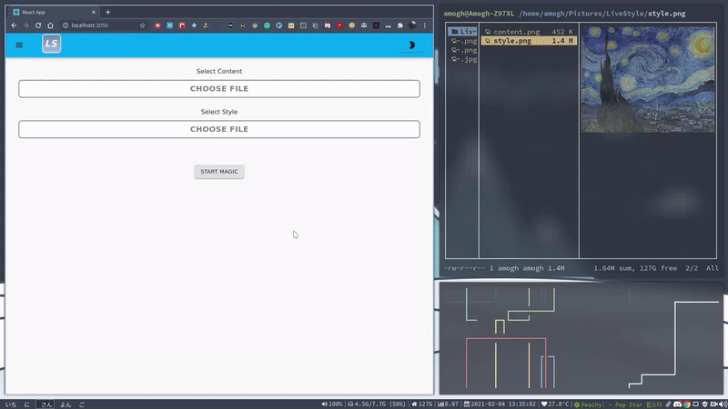
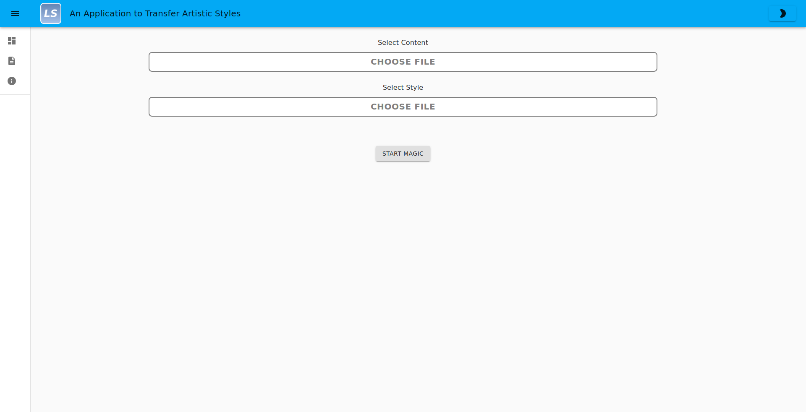
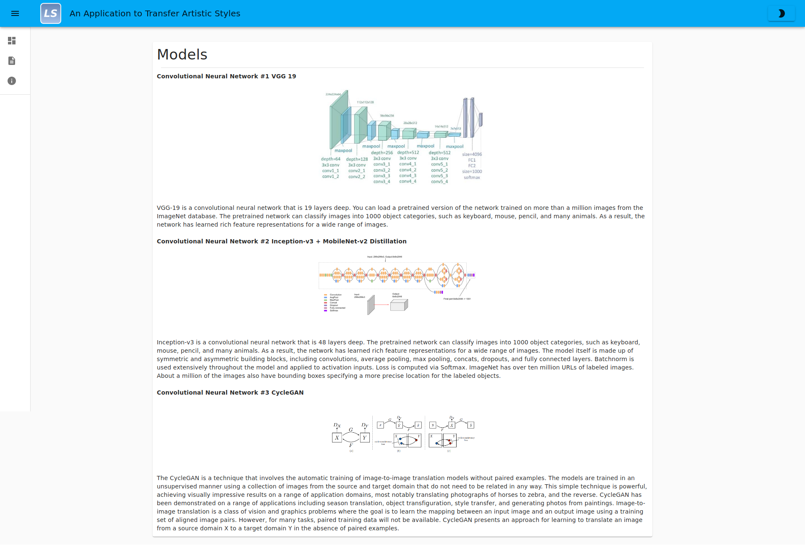
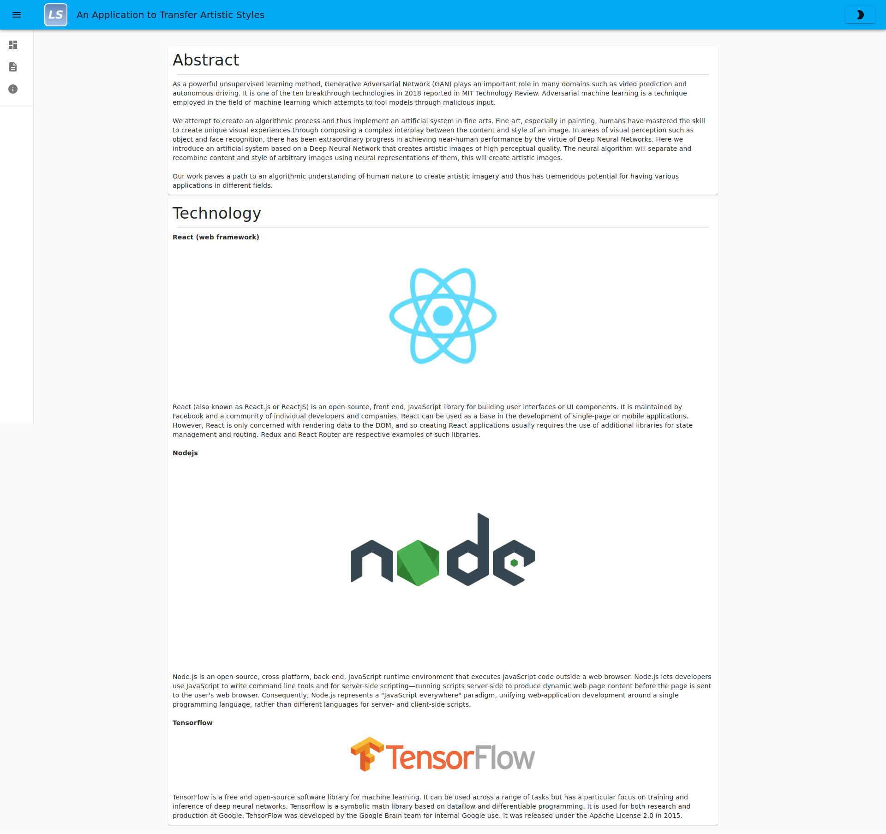

    

<h3 align="center"> Live Style - An Application to Transfer Artistic Style</h3>
  

    Final Year Project for Bachelor of Engineering Information Technology Course
     
    <a href="#"><strong> Explore the docs » </strong></a>
     
     
    ·
    <a href="#">Report Bug</a>
    ·
    <a href="#">Request Feature</a>
    ·
  

## Table of Contents

- [About The Project](#about-the-project)
- [Dashboard](#dashboard)
- [Resources](#resources)
- [Getting Started](#getting-started)
- [Contributing](#contributing)
- [Team Members](#team-members)

## About The Project:

Art is a highly diverse range of human activities engaged in creating visual, auditory, or performed artifacts — artworks — that express the author’s imaginative or technical skill, and are intended to be appreciated for their beauty or emotional power.

We attempt to create an algorithmic process and thus implement an artificial system in fine arts. Fine art, especially in painting, humans have mastered the skill to create unique visual experiences through composing a complex interplay between the content and style of an image. In areas of visual perception such as object and face recognition, there has been extraordinary progress in achieving near-human performance by the virtue of Deep Neural Networks.

Here we introduce an artificial system based on a Deep Neural Network that creates artistic images of high perceptual quality. The neural algorithm will separate and recombine content and style of arbitrary images using neural representations of them, this will create artistic images.

Our work paves a path to an algorithmic understanding of human nature to create artistic imagery and thus has tremendous potential for having various applications in different fields.

## Dashboard

Here, you can upload the content and style image and get the output.

## Resources Page

Here, you can view the details of the models being used in this project.

## About Page

Here, you can read about the project and the technology stack being used.

## Getting Started:

### Development

1. Clone the repo
2. Run `docker-compose -f docker-compose.dev.yml up --build`
3. View [http://localhost:3050](http://localhost:3050)

## Contributing:

Contributions are what makes the open source community such an amazing place to learn, inspire, and create. Any contributions you make are **greatly appreciated**.

All you simply need to do is:

1. Fork the Project
2. Create your Feature Branch (`git checkout -b feature/AmazingFeature`)
3. Commit your Changes (`git commit -m 'Add some AmazingFeature'`)
4. Push to the Branch (`git push origin feature/AmazingFeature`)
5. Open a Pull Request

## Team Members:

| [Amogh Warkhandkar](https://github.com/amogh-w) | [Omkar Bhambure](https://github.com/blablabluomie) |
